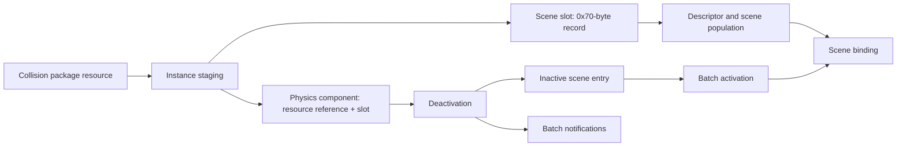

# Internal engine mappings

The integration goal is to make engine operations available to mods: finding a live object, changing its material, creating an entity, or subscribing to a gameplay event. That requires tracing the engine's own object relationships, lifetime rules, and execution stages. The [asset catalog](engine-research.md) supplies names and storage locations; this page records what happens beyond the files.

Rendering is one part of this work, alongside world/entity management, scripting, physics, UI, and streaming. A native bridge should ultimately issue engine operations through the appropriate subsystem. It must distinguish a resource being present on disk, loaded into memory, instantiated in a world, and ready for rendering.

## Working model and evidence boundaries

```text
Resource ID + runtime type
        |
        v
Resource manager ----> typed resource object + owned references
        |                          |
        v                          v
Loader / file adapter       type-specific load callback
        |                          |
        v                          v
Pack2 blocks                decoded data + resource state

Script path:    bundles -> resource IDs -> preload queue -> VM / script instance
Material path: metadata -> dependency IDs -> owned resource references
World/render:  ECS material ID -> resource / render handle -> RenderQueue -> GPU
```

This is a **working model**, not a complete verified execution graph. The Lua preload collection, resource callback paths, and material dependency resolver below were inspected in disassembly. The VM transition, material ECS handoff, render-queue consumer, and final GPU work still have gaps. Scheduling order cannot be inferred from the order of names in the executable.

## Shared resource infrastructure

Lua scripts and materials have different payloads but share infrastructure:

| Operation | Lua script | Material |
| --- | --- | --- |
| Runtime class | `content::LuaScriptResource` | `rend::MaterialResource` |
| Instance vtable RVA | `0x3bebee8` | `0x4f6ca38` |
| Reflected object size | `0xc0` | `0xc8` |
| Async loading method RVA | `0x711db0` | `0x30427c0` |
| Blocking loading method RVA | `0x711d30` | `0x3042730` |
| Shared async helper RVA | `0x31cef20` | `0x31cef20` |
| Shared blocking helper RVA | `0x31cf2a0` | `0x31cf2a0` |
| Type-specific reader RVA | `0x712150` | `0x3043bc0` |
| Shared state-publication helper RVA | `0x31cee00` | `0x31cee00` |

Both callback identities are supported by RTTI names that contain `requestLoad` or `blockingLoad`. Each pair converges on its class-specific reader. Both readers finish through a helper that atomically exchanges the resource state at `+0x68` with the value 4. Calling this a loaded-state transition is an interpretation of its position in the path; the complete state enum is not established.

Resource reference cleanup atomically decrements `+0x64`, and calls another engine routine when the previous count was one. This means keeping a resource usable involves ownership and release behavior, not merely remembering an address. The reflection/type-info vtable is also distinct from the resource-instance vtable.

All RVAs here belong to executable SHA-256 `2c6575be23ea9a2d316fb530d094773b371ab1da6344aa7a97b8cc2dabaf1ca0`.

## Lua: bundle identity to preload ownership

The `collectScriptsToLoadIntoVM` string initially leads to system **registration**, at `0x19c0330`. That function installs dispatcher `0x19bbee0`, which unpacks three arguments and transfers to the actual implementation at `0x19b3b80`.

The implementation performs these observable steps:

1. Reads bundle records through `SharedBundleState`: the array pointer is at `+0xd20`, count at `+0xd28`, and record stride is `0x90`.
2. Selects records whose associated object has state value 1 at `+4`, then compares their IDs with previously observed bundle IDs in `LuaPreloadQueue`. The meaning of that state value is not yet independently established.
3. Visits resource references associated with those bundles and compares their runtime type index against the Lua resource type index getter.
4. Collects the resource identifiers from resource objects at `+8`, sorts/deduplicates them, and checks the `LuaCachedScripts` hash table.
5. For a missing ID, calls typed request helper `0x19b7ce0`. That helper supplies a type descriptor at `0x5bec370` and forwards to the common resource manager at `0x31cab80`.
6. Moves a successful owned resource reference into the preload queue. The queue stores references at `+0`, count at `+8`, and capacity at `+0xc`; its previously observed bundle-ID array begins at `+0x10`.

This separates four identities/lifetimes: bundle ID, resource ID, owned resource object, and eventual script instance. An entity's persistent GlobalID and generation-checked runtime entity handle are additional, distinct identities.

The Lua resource reader at `0x712150` uses the file object's virtual operations to obtain its length, reads one byte into resource `+0xb8`, allocates/resizes a compact buffer at `+0xa0`, and reads the remaining bytes into that buffer. The first byte's meaning and the consumer of the buffered representation still need tracing. Loading these bytes is not proof that the VM has instantiated or initialized the script.

The registered `processThrottledLoading` dispatcher at `0x19bd7b0` is the next concrete target for following preload ownership into the VM. ECS signatures also name `LuaScriptPendingResource`, `FreshlyCreatedLuaScript`, `LuaInitEvents`, and `LuaPendingCallbackInstallations`; these identify additional lifecycle stages without yet proving their complete ordering.

## Rendering: material data and dependency ownership

The material reader replaces an owned data object stored at resource `+0xa8`, explicitly destroys the previous object, and invokes decoder `0x304c9b0`. The decoder receives a file wrapper, the material data object, and a metadata body selected after checking the metadata type. This is a concrete connection between packaged metadata and runtime representation.

A separate method dispatches to dependency resolver `0x3042b90`. It traverses three metadata arrays of resource IDs and requests each dependency through the same resource manager used by script preloading:

| Metadata body | Runtime material data destination | Requested type descriptor |
| --- | --- | --- |
| Array `+0x30`, count `+0x38` | Array at `+0x10`, stride `0x20`, reference at record `+8` | `0x5e60cc0` |
| Array `+0x20`, count `+0x28` | Reference array at `+0x20`, stride 8 | `0x5e76dd8` |
| Array `+0x10`, count `+0x18` | Reference array at `+0x30`, stride 8 | `0x5d2b790` |

The IDs become owned runtime references, with old references released during replacement. The exact names of all three dependency types are still unresolved; they should not be labeled texture/shader dependencies solely from appearance.

`rend::TextureResource` has another distinct object layout: reflected size `0x1b8`, instance vtable `0x4ddc780`, and async loading entry at `0x2e8ed20`. One branch builds metadata-driven setup arguments; another creates a `LambdaStreamJob` identified by RTTI as belonging to `TextureResource::requestLoad`, atomically appends it to a queue, and notifies a worker. The branch selector and metadata field semantics still require investigation. Texture loading is therefore not interchangeable with invoking the generic material reader.

ECS metadata separately names `MaterialResourceID`, `MaterialResource`, `MaterialRenderHandle`, `MaterialOverrideTargets`, and `coregame::global::RenderQueue`, with material stream-in, stream-out, and destruction systems. These are leads for connecting world objects to rendering. Material release code also allocates command storage through a global context at `0x5e69000`; identifying its consumer is a specific next step.

The GPU-facing work remains open: command decoding, shader selection, pipeline-state objects, descriptor binding, visibility, pass scheduling, and resource retirement. None of the recovered load methods is established as a safe draw or material-edit API yet.

## What this means for the mod bridge

The intended boundary is an operation with an engine-owned lifetime, rather than exposing raw memory to Wasm. For example, a future material override could:

1. Resolve a validated entity handle to its material target.
2. Resolve and retain the requested material resource and dependencies.
3. Apply the override through the engine's update/render command path.
4. Release it on removal, entity destruction, or stream-out.

This is a proposed integration contract, not an implemented SDK call. The same approach applies to spawning, scripting events, and physics operations: find the engine's existing operation, establish ownership and execution context, then expose a bounded guest API. This can give sandboxed mods useful native engine capabilities while keeping native code in the trusted bridge.

## Reproduce the static checks

The reviewed maps preserve object-layout evidence, function roles, exact reference sites, and unresolved questions:

- [Lua resource map](research/lua-resource-map.json)
- [Material resource map](research/material-resource-map.json)

```powershell
python tools/verify_engine_map.py "F:\SteamLibrary\steamapps\common\CONTROL Resonant\CONTROLResonant.exe" docs/research/lua-resource-map.json
python tools/verify_engine_map.py "F:\SteamLibrary\steamapps\common\CONTROL Resonant\CONTROLResonant.exe" docs/research/material-resource-map.json
```

Each map checks 24 encoded references after requiring an exact executable fingerprint. Checks cover vtable pointers, relative calls/jumps, address loads, and constants. They detect a mismatched map; they do not prove semantic labels, thread ownership, complete function signatures, or live behavior. No game functions are executed.

## Player mesh and collision ownership

The supported executable's component registrations and lifecycle callbacks establish the layouts below. Sizes are supported by both registration descriptors and array-stride instructions. These are static findings, not live payload validation or an SDK ABI. The [entity resource map](research/entity-resource-map.json) pins the encoded references to the executable fingerprint.

| Component | Hash | Size / alignment | Observed payload |
| --- | --- | --- | --- |
| `MeshResourceID` | `6f477177` | 8 / 8 bytes | Eight-byte IDs gathered by mesh streaming |
| `MeshResource` | `eece657a` | 8 / 8 bytes | Owned resource pointer at +0 |
| `PhysicsResourceID` | `4a8e27fd` | 8 / 8 bytes | Registered ID storage; acquisition path unresolved |
| `CollisionResource` | `e1da5fb1` | 16 / 8 bytes | Owned resource pointer at +0; byte at +8, meaning unresolved |
| `MeshMaterialSet` | `355cf83d` | 1 / 1 byte | Resolved material-set selector, not an owned resource pointer |
| `CharacterControllerBody` | `167fac8a` | 8 / 8 bytes | Owned controller-body object pointer |

Mesh registration at RVA `0x197ba60` installs cleanup `0x196fa60` and move `0x196fb00`. Collision registration at `0x1914650` installs cleanup `0x1904990` and move `0x1904a50`. Both cleanup routines atomically decrement the pointed-to resource's 32-bit reference count at +0x64. When the old count equals one, they call `0x31cf8c0`, passing the resource and its +8 value. Collision cleanup also clears its pointer slot. Move callbacks transfer pointers and clear source slots without acquiring another reference; collision moves additionally copy the +8 byte. A raw pointer copied by an observer therefore does not acquire ownership.

Mesh stream-in registration selects dispatcher `0x1977e20`, which calls implementation `0x196b9e0`. The implementation gathers eight-byte IDs, passes input/output arrays to batch lookup `0x31cabf0` with type descriptor `0x5e73b20`, and stages returned pointer values in command-buffer storage. Helper `0x19730c0` uses the `MeshResource` component hash. Command execution and resource readiness checks remain to trace. Stream-out dispatcher `0x1977b60` reaches `0x1974b90`; its registration query associates it with removal of `MeshResource` from entities outside the streamed-in set.

Accessor offsets require the correct base address. The mesh path passes `world+8` to a query iterator builder, while accessor fragments use component metadata offsets +8/+0x1c and chunk-table offset +0x48. Adding eight reconciles these with the movement inspector's +0x10/+0x24 metadata and +0x50 chunk table. This is evidence for a shifted query view, not an additional component table. Trace the iterator builder's output before reusing those accessor fragments against a movement snapshot.

The physics trace below follows `physics_module::streamIn` through resource acquisition and object staging; collision-template selection and backend actor creation remain incomplete. Its executable signature includes transform, layer, scale, frozen/keyframed state, collision resources and physics-scene inputs; the signature alone does not establish field offsets or parameter semantics. Neither mesh nor collision pointers should be retained across frames or exposed to Wasm based on this static pass.

Verify the reviewed references without running the game:

```powershell
python tools/verify_engine_map.py "F:\SteamLibrary\steamapps\common\CONTROL Resonant\CONTROLResonant.exe" docs/research/entity-resource-map.json
```

### Material selection and visibility commands

`MeshMaterialSet` registration `0x18f5800` specifies one-byte storage. `updateMaterialsToRenderer` dispatcher `0x19783c0` calls `0x196b0c0`. On dirty bit 0, that implementation looks up a 32-bit material-set name through `0x303d5c0`, stores the result's low byte into the selector, and emits renderer opcode `0x70` with a render handle and the selector. Lookup treats name 0 and `0x933b5bde` as selector 0; otherwise it searches 24-byte entries at object+0x180, count+0x188, and returns a one-based index. Missing names are reported invalid and the caller falls back to selector 0. This establishes selection behavior, not material replacement or shader parameter editing.

`applyHide` registration `0x197d0e0` selects dispatcher `0x1977540`, which calls `0x1969ca0`. Its inputs are a four-byte `HideReason` and one-byte `InvisibilityReason`; either nonzero means hidden. A state change updates one-byte `MeshHidden`, changes bit 16 of the four-byte `MeshFlags`, and collects the 32-bit renderer handle from `RenderObject+0x10` (component stride 24). Renderer opcodes `0x69` and `0x6a` respectively hide and show those handles. Small command headers pack opcode into bits 0?8 and element count above bit 8.

Command storage comes from `*(renderer_global+0x18)`, with global RVA `0x5e69000`. Allocation helper `0x2fb8340` receives storage, byte length and a wait flag. Producers write the payload, publish its length at allocation-8, increment storage+0x30 by two atomically, and notify if the previous low bit was set. The notification thunk `0x393109d` imports `__std_atomic_notify_one_direct`. This producer-side protocol is traced; downstream GPU execution is not.

The [visibility experiment](visibility.md) uses this observed path, on the owning mesh phase, with fresh entity and query-membership validation. It deliberately leaves native hide reasons intact and lets the original system restore its cached state after the lease ends. Live behavior remains unverified.

### Physics acquisition and controller ownership

Physics stream-in registration selects `0x191ac10`, whose dispatcher calls `0x18fdf10`. One resource-ID branch calls typed resource lookup `0x31cab80` using descriptor `0x5d215f0`, transfers the returned reference out of its temporary wrapper, and calls metadata accessor `0x2d44280`. That accessor validates a type key before returning metadata. The path branches on metadata+0x3b; the semantic name of this flag is not established.

In one branch, factory `0x1914520` allocates a 0x1b8-byte object and calls constructor `0x2d0b3a0`. The stream-in implementation copies resource data reached through resource+0xa0, then calls `0x2d0b810` to populate the new object and additional helpers to process its contents. These instructions establish resource-to-runtime-object staging. Actor/shape creation, physics-scene insertion, mass and collision-filter semantics still need backend tracing; this object must not yet be described as a verified PhysX actor.

`CharacterControllerBody` registration `0x1ba1aa0` installs an eight-byte stride. Cleanup `0x1b9ac90` delegates each slot to `0x1ba3be0`: it releases an allocation at owned-object+0x38, destroys objects at +0x10 and +0 through `0x2d17060`, frees those objects, then frees the container. Its move callback `0x1b9ad10` transfers the pointer and zeros the source. This is distinct from the shared mesh/collision resource reference-count protocol. The two nested physics objects' exact roles remain unresolved.

### Collision package loader

RTTI identifies `physics::CollisionPackageResource`, instance vtable `0x4d6db50`, with reflected size 0x270 and alignment 8. Its request-load slot reaches `0x2d441b0`, which uses FileBuffer loader `0x31cf050`. The callback at `0x2d45570` forwards to reader `0x2d44a60`.

The reader validates metadata through its type key. When metadata+0x3b is nonzero, it retains a copy of incoming bytes in a compact buffer: pointer at resource+0xa0, length at +0xa8, capacity at +0xac. It then calls decoder `0x2d442c0` and publishes completion through `0x31cee00`, the same completion helper previously traced for Lua and material resources. Thus the +0x3b branch controls byte retention in this reader, although its original field name and all consumers are not established.

The decoder creates another copy aligned to 0x80 bytes, owned at resource+0xb0 and initially referenced by +0xb8. It processes a structured stream and populates additional resource data. The complete binary schema and native actor bindings remain unresolved; these fields are not exposed as a modification API.

### ECS physics handles and scene staging

A further trace establishes the 16-byte `coregame::component::Physics` representation, hash `6ebfd07c`: an owned resource reference at +0, a 32-bit scene slot at +8, and a state byte at +0xc. Registration `0x438730` specifies size 16/alignment 8. The stream-in path increments the resource reference and stages this payload through the component command helper `0x1909210`. Cleanup `0x4368c0` releases the reference and clears +0; this component cleanup alone is not scene removal.

Instance staging `0x191ede0` calls `0x2ce2ff0`, which takes an index from a free list, marks an occupancy bit, and stores a 0x70-byte scene record. The record array pointer is at scene-owner+0xc8. Resolver `0x2ce32b0` returns that array plus index times 0x70; it performs no bounds or generation check. The index must therefore not be treated like the generation-bearing ECS entity handle or retained as a stable mod handle.

The record owns a moved allocation at +0x40 with associated length/capacity at +0x48/+0x4c; the source fields are cleared. It stores its slot index at +0x50 and an initialized marker at +0x60. Staging then prepares a descriptor through `0x2d68180`, calls population helper `0x2d81a60`, and calls binding helper `0x2d812c0`. The concrete backend object classes and argument semantics below these helpers remain unresolved.

Deactivation helper `0x191be70` resolves the component's slot and, when component+0xc is set, calls `0x2d819b0` then clears that byte. The latter checks scene-record+0x58, processes an object array through `0x2cfea80` and per-object helper `0x2d83ac0`, then clears record+0x58. State application at `0x19019a0` calls `0x2d816c0` to activate inactive entries. This routine submits backend objects and sets record+0x58 to one; it is not a cleanup routine. Deactivation and activation are distinct lifecycle stages; zeroing a component pointer or toggling a cached byte cannot replace them.



The [physics scene map](research/physics-scene-map.json) contains reproducible executable checks. It does not establish callable APIs. Physics modifications still require resolving slot recycling, update ordering, and the specific property being changed.

### Backend handles and deactivation notifications

The array at the scene record's +0x20 object, offset +0x90 with a 16-bit count at +0xa8, contains **eight-byte handles**, not directly callable object pointers. Deactivation passes each handle to resolver `0x2d83f70`. That resolver uses only the low 32 bits to index the pointer table at backend-owner+0x1d0, with no local bounds or generation check. The upper bits' meaning and the checks performed by callers remain unresolved.

Batch helper `0x2cfea80` resolves those handles and calls virtual slot +0x30 on each resulting object. It groups objects by the non-null pointer returned from that call. For each group it invokes virtual slot +0xf8 on the returned owner, passing the object-pointer array, its count, and the inverse of the incoming boolean. This establishes an owner-grouped backend operation in the deactivation path. Identifying these virtual methods as specific middleware APIs still requires tracing the concrete vtables.

Deactivation also handles a separate pointer table at backend-owner+0x1f0. Helper `0x2d83ac0` reads it through `0x2cd55c0`, appends a non-null pointer to a pending array in its second argument (+0x20 pointer, +0x28 count, +0x2c capacity), then clears the table entry through `0x2cd55e0`. It does not directly destroy that pointer. The installed callback described below clears this notification list without destroying its elements; final pointee ownership is still unresolved.

The binding path has another index space. Helper `0x2d812c0` allocates indices from backend-owner+0xd8 and writes them to the instance array at +0xe0, using the 16-bit count at +0xfa. It reads pairs of 16-bit indices at +0x7c/+0x7e from 0x230-byte source records, maps them through `0x2d689f0`, and selects endpoint handles from instance+0x90. Helper `0x2cf1030` stores two optional eight-byte endpoints in 24-byte records at owner+0x138 and updates reverse associations. This resembles a relationship/constraint binding path, but the precise constraint types are not yet established. Its indices must not be confused with scene slots or backend object handles.


### State application and the batch callback

The batch activation routine `0x2d816c0` collects handles only from entries whose +0x58 flag is zero. Helper `0x2cfe730` resolves each handle, checks backend object virtual slot +0x30, and skips objects already attached to an owner. For unattached objects it resolves a destination through `0x2ccc3b0`, `0x2ce57c0`, and virtual slot +0x10. It groups object pointers by destination and invokes destination virtual slot +0xe8. This complements deactivation's owner slot +0xf8. The precise middleware method names are not established by these call sites alone.

Activation then reapplies two cached vector channels through `0x2cfc840` and `0x2cfc930` when nonzero, processes binding state, and sets scene-record+0x58 to one. Those vector helpers update engine-side caches before dispatching to backend virtual slots +0x280/+0x288; they require object type word +8 to equal 7 and test bit 0 of the value returned through virtual slot +0x1c0. Their exact property names and units remain unverified. Writing only the backend object would bypass the cache updates visible here.

RTTI identifies the batch callback as a lambda installed by `rigidbodyfactory::initCoreGamePhysics`, accepting an ECS world view and `physics::Batch&`. Initialization `0x2198eb0` constructs the callback with vtable `0x4a493a0` and transfers it into `PhysicsBatchProcessing`. Invoke slot +0x10 is `0x2199020`, which calls implementation `0x219adc0`. State application invokes the configured callback at `0x1901df5` before releasing the batch arrays.

This implementation iterates the first list (pointer +0, count +8), tests bit 0x20 returned by `0x2ccc470`, and appends selected handles with an additional byte to 12-byte factory records. It then clears all three counts at batch+8, +0x18 and +0x28. It does **not** iterate or destroy the associated pointers in the third list at +0x20. The caller subsequently frees that list's backing allocation, not its pointees. Thus this path establishes batch notification consumption, not deferred destruction. A replacement callback could behave differently; live callback identity and final associated-pointer ownership remain to verify.

### Physics materials and friction

Loader `0x3d4650` references `physics_materials.json` and reads named `static_friction`, `restitution`, and `dynamic_friction` values. It also reads `transparent`, `pierce`, and `audio_transparent` booleans. It passes an array of 0xa0-byte records to registry population `0x2ce8720`, obtaining the registry through accessor `0x2ce8600` (global pointer RVA `0x5d20280`). This identifies a physics-material path distinct from rendering materials and character movement friction.

The population routine copies these records and uses the following offsets within each record:

| Offset | Observed field |
| --- | --- |
| +0x88 | Case-folded FNV-1a name hash produced by the loader |
| +0x90 | Static friction float |
| +0x94 | Restitution float |
| +0x98 | Dynamic friction float |
| +0x9c / +0x9d / +0x9e | Transparent / pierce / audio-transparent bytes |

Registry+0 holds the record array, with count at +8. A separate array at registry+0x50 stores returned backend material pointers, with count at +0x58. Population passes static friction, dynamic friction, and restitution in that order to backend virtual slot +0x180, reached through `*(*(base+0x5d202e8)+0x20)`. The returned pointer is stored at the matching material index. Concrete backend type, shape attachment, reference ownership and release still require tracing.

Two registered settings are explicitly labeled “Globally disable static friction (requires restart)” and “Globally disable dynamic friction (requires restart)”. Population tests their value bytes at RVAs `0x5d202e0` and `0x5d202c0`, respectively, substituting zero into backend creation arguments. The copied engine records retain their original values. This establishes creation-time overrides; it does not establish that toggling these bytes updates existing materials. The registry population routine must not be treated as a live-update API: its replacement and backend-pointer lifetime behavior remain unverified.

The executable also contains separate `groundFriction`, `groundFrictionMul`, and character collision friction settings. Their presence alone does not connect them to this registry. A global “ice” effect may require both contact-material changes and character movement changes; that remains a research hypothesis, not tested behavior. The [physics material map](research/physics-material-map.json) records the verified references for this trace.


### Material sharing, lookup and registry teardown

Material lookup `0x2ce8bd0` takes a numeric ID, uses registry+0x10 as an ID-to-record-index table, then reads the backend pointer from registry+0x50. An ID outside the mapping-table count (+0x18) returns the separate fallback pointer at backend-global+0x38. Unlike record lookup `0x2ce8c10`, this backend-pointer lookup does not reject a negative mapped index or check it against the record count. These helpers have different preconditions; they are not interchangeable safe public accessors.

Shape-construction path `0x2cff810` reads a material ID from its input+0x28 and calls that lookup. It passes the returned pointer as a one-element material array to backend virtual slot +0x100, with geometry and flags. It then resolves a body handle through `0x2d83f70`, passes the created shape to body virtual slot +0xb8, and invokes shape slot zero to release its temporary reference. This is static evidence that repeated use of a material ID passes the same registry pointer into shape creation; backend reference-count changes and concrete implementation identities remain to trace. Another path at `0x2d0d800` builds a material-pointer array by resolving byte-sized material IDs, so the single-material case is not the only representation.

Registry teardown `0x2ce8640` invokes slot zero on every backend pointer in registry+0x50, frees the array and lookup storage, destroys the record array, frees the registry, and clears global `0x5d20280`. The fallback pointer comes from a different owner and is not part of this loop. Calling registry population again is not a verified replacement operation: the traced population routine clears pointer counts and overwrites entries without the release loop observed in teardown.

A separate inspection of the shipped `PhysX_64.dll` found generated metadata for `DynamicFriction` and `StaticFriction`. Static-friction metadata references wrappers at DLL RVAs `0xa9c0` and `0xa910`, which forward to virtual slots +0x48 and +0x40. This identifies a property-access pair; getter/setter direction and concrete material implementations remain unresolved. These DLL RVAs are **not executable RVAs** and require the separate fingerprint in [the backend material map](research/physx-material-map.json). No wrapper or material operation has been called by the mod runtime.

### Rigid-body mass, inertia and movement properties

Generated metadata in the shipped physics DLL connects named rigid-body properties to access wrappers. The generated value-copy path corroborates read direction by copying returned scalars and vectors into a snapshot. The table lists **virtual-table byte offsets**, not object fields or callable addresses. The DLL fingerprint and wrapper RVAs are recorded in the [backend rigid-body map](research/physx-rigid-body-map.json).

| Property | Read slot | Write slot | Game-side connection |
| --- | --- | --- | --- |
| Center-of-mass local pose | +0xf0 | +0xe8 | `0x2cfe500` updates cached translation and submits a pose |
| Mass | +0x100 | +0xf8 | `0x2cfdf80` updates cached mass then the backend |
| Mass-space inertia tensor | +0x118 | +0x110 | `0x2cfdfd0` updates cached three-component inertia then the backend |
| Linear damping | +0x130 | +0x128 | `0x2cfd090` resolves the body and writes the scalar |
| Angular damping | +0x140 | +0x138 | `0x2cfd120` resolves the body and writes the scalar |
| Maximum linear velocity | +0x160 | +0x158 | Backend access identified; game update path unresolved |
| Maximum angular velocity | +0x170 | +0x168 | Backend access identified; game update path unresolved |
| Rigid-body flags | +0x1c0 | +0x1b8 | Read by game velocity helpers; individual flag semantics not established here |
| Linear velocity | +0x148 | +0x280 | `0x2cfc840` updates engine and instance caches before backend submission |
| Angular velocity | +0x150 | +0x288 | `0x2cfc930` updates engine and instance caches before backend submission |

The mass helper indexes a four-byte cache through owner+0; inertia uses a 12-byte cache through owner+0x10; center-of-mass translation uses a 12-byte cache through owner+0x40. Each then resolves the backend handle and only dispatches the property write when object type word +8 equals 7. Cache updates precede that type check. These details rule out treating a backend-only write as equivalent to the engine helper. Handle validity, scheduling and concrete backend validation remain unverified.

Property application around `0x2d834ab` branches on a descriptor byte at +0x10. One branch reads an explicit inertia vector at +0x14 and center-of-mass translation at +4. The alternative calls `0x2cfe040`; its full computation is not yet mapped. Both converge on mass application from descriptor+0. A subsequent branch applies linear and angular damping from descriptor+0x20/+0x24. These offsets are relative to the local descriptor selected by this path, **not** an ECS component or backend body. Density-to-mass derivation and units are not established by this trace.

The earlier unnamed cached vector channels are now connected to linear and angular velocity through the DLL's named metadata. Both game helpers check body flags before backend submission, and both pass a boolean value of one. The precise boolean semantics and how simulation consumes updates still require implementation tracing.

Additional metadata identifies inverse mass, inverse inertia, sleep threshold, stabilization threshold, wake counter and scene gravity. Scene gravity metadata references a write wrapper at DLL RVA `0xc200` forwarding to slot +0x2a8. This does not establish per-body gravity controls or game-specific overrides. Forces and impulses are operations rather than entries in this property table and remain to trace separately.

The [game rigid-body map](research/game-rigid-body-map.json) verifies the game helper connections. No runtime writes or API additions are part of this research. The next investigation is force/impulse accumulation and gravity overrides, followed by the alternate inertia-computation branch and the simulation phase in which these operations are applied.
