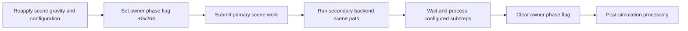

# Physics dynamics research

This page connects game-side body operations to the shipped physics backend. It is a research map, not a supported mod API. The read-only observer samples body state; its schema-4 diagnostic also compares damping getters.

Game RVAs refer to the executable fingerprint in the [game dynamics map](research/game-dynamics-map.json). DLL RVAs refer to the separate `PhysX_64.dll` fingerprint in the [backend dynamics map](research/physx-dynamics-map.json). Virtual slots are byte offsets into a vtable, not object fields. See [engine internals](engine-internals.md) for entity handles, resource ownership, material sharing and the initial property table.

## Evidence and limitations

| Area | Established from the binaries | Still unresolved |
| --- | --- | --- |
| Force and impulse | Body helpers, mode arguments, accumulator storage, consumption and conditional clearing | Gameplay-wide producers, all consumer branches and complete solver timing |
| Per-body gravity | Setter/getter, disable flag, game reset and queued actions | All overriding systems, recreation and character-controller behavior |
| Scene gravity | Game setting, vector construction, backend submission, temporary immediate-mode override | Interaction with all local gravity/anomaly systems |
| Mass and inertia | Concrete backend setters, inverse-value conversion, computed-inertia clamp and cache updates | Full shape mass integration, density derivation and all invalid-input behavior |
| Damping, sleep and solver properties | Diagnostic-identified setters, dynamic vtable slots, alternate damping storage and propagation | Engine-side ownership, units, overrides and phase-correct modification |
| Simulation | Normal submission/wait sequence, completion task, substeps, immediate-mode solver calls | Complete scheduler dependency graph, callback exclusion and immediate-mode data layouts |

## Concrete rigid-body backend

DLL constructor `0x20970` writes type word 7 at object+8 and ultimately installs vtable `0x15dd88`. The table connects the previously mapped virtual slots to concrete functions:

| Slot | DLL RVA | Operation and evidence |
| --- | --- | --- |
| +0x30 | `0xed00` | Scene lookup slot used by the game before applying forces |
| +0x50 | `0x23380` | Single actor-flag setter; diagnostic names `PxRigidActor::setActorFlag` |
| +0x60 | `0x217d0` | Actor-flags read slot used by the gravity getter |
| +0xf8 | `0x24e20` | Mass setter, corroborated by named property metadata |
| +0x110 | `0x24e90` | Inertia setter, corroborated by named property metadata |
| +0x188 | `0x20c10` | `PxRigidDynamic::addForce`, identified by diagnostics |
| +0x190 | `0x20f50` | `PxRigidDynamic::addTorque`, identified by diagnostics |

The constructor and concrete force functions establish the dynamic-body connection more strongly than slot resemblance alone. Live object identity and lifetime still need observation before these addresses can be used as a modification interface.

## Forces, impulses and accumulation

The following game helpers resolve an eight-byte body handle through `0x2d83f70`, require backend type word 7, reject body-flags bit 0, and require a non-null scene. They pass a three-float vector, a mode integer and a boolean value of one to the backend.

| Game helper RVA | Backend operation | Mode | Meaning |
| --- | --- | --- | --- |
| `0x2cfcc30` | addForce | 0 | Force |
| `0x2cfcd50` | addForce | 1 | Impulse |
| `0x2cfcb10` | addForce | 2 | Velocity change independent of mass |
| `0x2cfcba0` | addTorque | 2 | Angular velocity change independent of inertia |

Mode terminology follows NVIDIA's [force-mode definitions](https://nvidiagameworks.github.io/PhysX/4.0/documentation/PhysXAPI/files/structPxForceMode.html); the local mode arguments and branches are independently traced. This reference supplies names, not proof that the shipped DLL is that SDK version.

DLL `addForce` forwards the linear vector to `0x20d20` with a null angular-vector argument; `addTorque` uses the angular-vector argument. In that dispatcher, modes 0 and 1 multiply the linear input by inverse mass through helper `0xfe570` and transform angular input through a matrix-producing helper. The inverse-mass interpretation is corroborated by `0xff320`, which writes the mass setter's reciprocal to the same fields that `0xfe570` reads. Mode 1 then reaches the same accumulator path as mode 2, which skips that scaling. Mode 0 reaches the alternate accumulator path also used by mode 3. This matches the distinction between velocity-change and acceleration accumulation in NVIDIA's [rigid-body API](https://nvidia-omniverse.github.io/PhysX/physx/5.1.3/_build/physx/latest/class_px_rigid_body.html).

Concrete force and torque implementations reject certain simulation-running states, reject a body-state bit, and contain a direct-GPU-mode rejection path. After forwarding a vector, they call `0x25e70` with both the incoming boolean and a test for nonzero input. These checks constrain when the backend accepts a force or torque request.

The game-side helpers return without applying anything when their checks fail; their call sites do not receive a structured success result. A normal return therefore does not confirm that the change was applied.

### Accumulator storage and consumption

The dispatcher passes actor+0x50 to wrappers `0xfe4b0` and `0xfe4c0`. Each dereferences that pointer to obtain an internal simulation object. Its +0xc0 points to a pooled 0x40-byte state block. These are internal pointers, not stable body handles.

| State-block offset | Interpretation when tag +0x1f is zero | Add routine | Explicit clear routine |
| --- | --- | --- | --- |
| +0x00 | Linear acceleration | `0x11d350` | `0x11d4d0` |
| +0x10 | Angular acceleration | `0x11d350` | `0x11d4d0` |
| +0x20 | Linear velocity change | `0x11d410` | `0x11d530` |
| +0x30 | Angular velocity change | `0x11d410` | `0x11d530` |

Each vector occupies three floats. Add operations sum components; the explicit clear operations select linear/angular vectors with separate boolean arguments. The add routines call `0x11dc70` with mask 2 for acceleration or 4 for velocity change. It marks simulation-object+0xc8 and, on one branch, marks a scene bitset indexed by the body. Thus copying vector fields would omit required scheduling bookkeeping.

Allocation/initialization helper `0x11e060` obtains blocks from a scene-owned free list and initializes the selected representation. The block is a union: tag +0x1f equal to one selects a different representation containing saved body properties, including inverse mass. Offsets in the table must not be interpreted as forces in that state.

Consumer `0x11e630` checks the dirty masks and representation. Its core calculation is:

```text
linear_delta  = accumulated_linear_velocity_change  + timestep * accumulated_linear_acceleration
angular_delta = accumulated_angular_velocity_change + timestep * accumulated_angular_acceleration
```

One branch adds these deltas to body-core vectors at +0x50 and +0x60. Other branches divide by the timestep and write outputs for later processing. Call sites at DLL RVAs `0x118a92`, `0x11a739` and `0x11bb8e` reach this consumer; their complete solver/scheduler relationships remain unresolved.

The consumer's tail conditionally clears the buffers. With bit 7 clear in the flags byte reached through simulation-object+0x98, then +0x1c, it clears all four vectors. With that bit set it clears only the velocity-change vectors and retains acceleration. This behavior is consistent with NVIDIA's [acceleration-retention flag](https://nvidia-omniverse.github.io/PhysX/physx/5.1.3/_build/physx/latest/struct_px_rigid_body_flag.html), but the complete public-flag-to-internal-field route still needs tracing. Retention is therefore a conditional observed behavior, not a guarantee that every force disappears after one game frame or persists across every substep.

## Per-body gravity and gameplay overrides

Game setter `0x2cfd1b0` resolves a dynamic body, inverts its incoming enable boolean, and dispatches actor-flag value 2 through slot +0x50. Getter `0x2cfd200` reads slot +0x60 and returns the inverse of flag bit 1. For a nonmatching body type the setter does nothing and the getter returns true; that fallback is not evidence that gravity is enabled on every unsupported body.

NVIDIA's [actor-flag declaration](https://nvidia-omniverse.github.io/PhysX/physx/5.1.3/_build/physx/latest/program_listing_file_include_PxActor.h.html) identifies value 2 as `eDISABLE_GRAVITY`. The shipped setter's diagnostic also rejects changes during simulation. No per-body gravity vector is established by this flag; it controls participation in scene gravity.

The game has its own callers that can replace a mod's choice:

- `heron::impulse_wave::reset_gravity::system` registration selects dispatcher `0x2434430`, which calls implementation `0x2422d60`. A branch in that implementation iterates body handles and calls the gravity helper with true.
- Pending-action implementation `0x2429c70` processes 0x50-byte records. It reads a signed action tag at +0x40 and a body handle at +0. Tag 1 uses the boolean at +8 to change gravity. The default branch after handling the other tags applies an impulse vector from +0x10; the complete producer-side tag definition remains unresolved. After processing, it clears the action count.

Consequently, one successful gravity write does not establish a persistent override. The producing systems and their restoration rules must be understood before deciding how a mod should retain control. This is also distinct from the player's character-controller gravity and movement plane.

## Scene gravity and simulation sequence

The registered `coregame::physics_module::simulate` dispatcher `0x190e4d0` jumps to `0x1901fa0`. Each invocation constructs a vector at scene-owner+0x26c with x/z zero and y equal to approximately -9.81 times the value at RVA `0x5c09120`. Setting registration identifies that value as `Physics:Gravity Scale`.

Configuration helper `0x2ce5210` passes this vector to `0x2cdc6c0`, which invokes scene virtual slot +0x2a8, independently matched to the DLL's named gravity metadata. This demonstrates that a direct backend scene-gravity edit can be overwritten by the game's next simulation call.

The normal branch then follows this sequence:



`0x2ce5330` stores the timestep at owner+0x260, sets +0x264, and enters `0x2cdba00`. That routine divides the timestep by the configured substep count (`PhysX:Substeps Amount`, value RVA `0x5d1fba8`) and submits backend scene slot +0x250 with task/scratch arguments. `0x2ce5360` enters a secondary path at `0x2cd5b40` that also submits slot +0x250 and calls slot +0x278 with a blocking boolean. The precise role of that secondary scene has not been established.

`0x2ce5380` calls `0x2cdbaf0`, which waits through `0x2cdbbf0` and submits remaining substeps. The wait helper polls a completion byte at its own owner+0x170 while calling a scheduler helper, then performs body bookkeeping. Only after this returns does `0x2ce5380` clear scene-owner+0x264. The outer simulation implementation finally enters post-processing through `0x2ce5310`.

RTTI identifies `physics::PhysXCompletionTask`, with vtable `0x4d54230`. Constructor `0x2cdb2f0` embeds this task at wrapper+0x148, the address passed during simulation submission. Its +8 virtual entry is `0x2cdb200`: after preparation it takes either scene slot +0x278 with a blocking boolean, or a split path using +0x280 and +0x290. It then calls two post-result helpers and atomically sets task+0x28 to one, which is wrapper+0x170. This connects the wait byte to an actual result-processing task; it is not merely a timer or a guessed idle flag. The branch-specific callbacks and task-manager ownership still need a complete trace.

The phase flag is evidence about this sequence, **not a lock** or a universal permission to write. It must not be polled from an unrelated worker as a substitute for owning the correct engine phase. The separate immediate-mode branch does not pass through this same begin/wait sequence.

Static tracing shows that both the completion-byte wait and downstream post-processing can execute scheduler work through `0x3271510` and `0x3272ad0`. Neither phase entry is therefore an established exclusive modification point; thread identity and an apparently waiting call are insufficient ownership tests. Follow the [scheduler and lifetime requirements](engine-validation.md#scheduler-and-lifetime-requirements) when evaluating a capture, including its record losses and lifecycle coverage.

### Immediate-mode solver sequence

When `Physics:Simulate With Immediate Mode` is enabled, the outer simulation implementation calls `0x2cc95a0` with a selection descriptor and timestep. Its main branch prepares several temporary arrays, then invokes the following imported functions. The names are read directly from this executable's PE import table, rather than inferred from virtual slots.

| Stage | Game call site(s) | Import from `PhysX_64.dll` |
| --- | --- | --- |
| Construct bodies in helper `0x2ccb5e0` | `0x2ccb92f`, `0x2ccbe0c` | `PxConstructStaticSolverBodyTGS` |
| Construct dynamic solver bodies in the same helper | `0x2ccbd57` | `PxConstructSolverBodiesTGS` |
| Prepare contacts in helper `0x2cca280` | `0x2ccaaab` | `PxCreateContactConstraintsTGS` |
| Prepare joints in the same helper | `0x2ccad99` | `PxCreateJointConstraintsWithShadersTGS` |
| Solve | `0x2cc985f` | `PxSolveConstraintsTGS` |
| Integrate | `0x2cc987e` | `PxIntegrateSolverBodiesTGS` |

The outer helper calls body construction before constraint preparation, then solve, integrate, and game helpers `0x2ccae20`/`0x2ccb320`. Those last helpers are downstream processing candidates; complete writeback semantics remain unverified. Likewise, the constraint/contact data layouts and which selected objects enter each array are not yet mapped.

The helper saves scene-owner+0x26c gravity, optionally replaces it with the descriptor's vector when descriptor+0x28 is set, and restores the saved vector on its normal cleanup path. The registered simulation caller supplies that presence flag as false. This establishes another gravity input path without proving that a gameplay anomaly or particular ability uses it.

## Computed inertia and backend storage

The alternate helper `0x2cfe040` resolves a dynamic body, obtains its shape count through slot +0xc8, caps collection at 256, and obtains shape pointers through +0xd0. It retains shapes whose returned shape-flags value has bit 0 set, then passes the selected array to `0x3918fd0`. The complete mass-properties integration inside that helper remains untraced.

The subsequent path optionally adjusts the matrix and center based on its fourth argument, divides requested mass by a computed scalar when that scalar is nonzero, and calls the imported `physx::PxDiagonalize` through executable IAT RVA `0x3a78f70`. It scales the resulting diagonal values. For a nonzero diagonal vector, it computes the median component and clamps each component between median/5 and median*5; the constant at `0x3ad140c` is 5.0. The zero-vector branch substitutes the requested mass in all three components. These are observed game-specific conditioning steps; they are not a general formula for every body or a complete validation policy.

The result is written to the engine's inertia cache and backend slot +0x110. Center-of-mass translation is also cached, and the returned orientation plus translation are submitted through slot +0xe8. The surrounding setup path separately applies mass afterward.

The now-resolved backend mass setter `0x24e20` converts positive mass to its reciprocal and passes zero otherwise, then forwards to `0xff320`. The inertia setter `0x24e90` converts each nonzero component to its reciprocal, preserving zero components as zero, before forwarding to `0xff2b0`. Both contain simulation-running rejection paths. This explains why raw backend fields cannot be assumed to store the same quantities as the engine's mass and inertia caches. It does not authorize arbitrary negative or nonfinite inputs.

## Damping, sleeping, and contact/solver properties

The same constructor-established dynamic-body vtable `0x15dd88` contains additional property setters. Method diagnostics identify their names independently of the slot numbers. The [property map](research/physx-properties-map.json) verifies 30 table entries, transfers, and constants. All addresses in this section are **PhysX DLL RVAs**; offsets are backend layout evidence, not guest API fields.

| Property | Vtable slot | Setter RVA | Reviewed behavior |
| --- | --- | --- | --- |
| Linear damping | `+0x128` | `0x24c30` | Transfers to `0xff3d0`; normal and tagged alternate storage |
| Angular damping | `+0x138` | `0x236e0` | Transfers to `0xfe880`; normal and tagged alternate storage |
| Minimum CCD advance coefficient | `+0x1c8` | `0x250d0` | Writes actor `+0x9c` |
| Maximum depenetration velocity | `+0x1d8` | `0x25010` | Flips the float sign bit and stores at actor `+0xac` |
| Maximum contact impulse | `+0x1e8` | `0x24fb0` | Transfers to `0xff4a0`; stores and propagates |
| Contact slop coefficient | `+0x1f8` | `0x24120` | Transfers to `0xff510`; stores and propagates |
| Kinematic target | `+0x210` | `0x24870` | Identified entry and phase guard; target processing not fully traced |
| Sleep threshold | `+0x228` | `0x259d0` | Transfers to `0xff530`; stores and propagates |
| Stabilization threshold | `+0x238` | `0x25cd0` | Transfers to `0xff290`; stores and propagates |
| Dynamic lock flags | `+0x278` | `0x25970` | Copies a flag byte to actor `+0xfe`; bit-to-axis mapping unverified |
| Solver iteration counts | `+0x290` | `0x25a30` | Packs two inputs into a 16-bit value, transfers to `0xff550` |
| Contact report threshold | `+0x2a8` | `0x240c0` | Applies scalar maximum with zero and stores actor `+0xbc` |

The reviewed setters reject an ordinary simulation-running state before modification. Kinematic-target entry `0x24870` has an additional exception when scene state at `+0x16ac` equals 2; its meaning remains unknown. These checks do not establish a mod scheduling window or comprehensive input validation.

Most helper calls receive **actor `+0x50`**, called the core below. Normal linear/angular damping lives at core `+0x78`/`+0x7c`. If the core has an associated simulation object and core flags `+0x2c` bit 0 is set, the helper instead accesses simulation-object `+0xc0` and requires representation byte `+0x1f` to equal **1**. It writes damping at that state's `+0x30`/`+0x34`.

That is the same state pointer whose **tag 0** interpretation holds force/velocity accumulators in the earlier trace. Reading `+0x30` without checking the representation can therefore mistake damping for an angular velocity-change term. The alternate path assumes its state invariant rather than providing a safe fallback for an invalid pointer.

The corresponding linear getter is slot `+0x130`, DLL RVA `0x22360`, which passes actor `+0x50` to `0xfe600`. The angular getter is slot `+0x140`, DLL RVA `0x21870`, forwarding to `0xfe4f0`. Both return a float and select the same normal or tag-1 storage described above. A missing or incorrectly tagged alternate state leads to an invalid read, not a normal-storage fallback. These accessor traces independently support the observer's storage selection. The [schema-4 diagnostic](engine-validation.md#native-damping-readback-schema-4) calls these getters with guarded identity and target checks.

Normal damping changes propagate through `0x10e7d0` when an associated simulation object exists. Sleep threshold, stabilization threshold, maximum contact impulse, and contact slop similarly write core `+0x94`, `+0x98`, `+0x90`, and `+0xa8`, respectively, before the same propagation route. The full downstream effect of `0x10e7d0` is not yet traced.

The solver-iteration setter packs the low byte of one input and the low byte of the next into the low/high bytes of a word. Helper `0xff550` writes core `+0x2e`, updates associated simulation-object `+0x8e` if present, and sets a downstream dirty byte. The semantic order of the two counts and their accepted ranges still require independent confirmation.

The game's binding catalog also exposes body-group awake/frozen/enable/kinematic controls and joint angular/linear velocity, free-spin, maximum-force, and detach candidates. These are group/joint operations, not necessarily per-body property setters. Their full callback argument schemas and engine override behavior remain open. Density, material combine modes, complete CCD flags, contact modification, articulation/joint limits, and character-controller movement properties are not fully mapped by this table.

### Game damping accessors and overrides

The [game damping map](research/game-damping-map.json) connects the backend methods to engine helpers and concrete property producers. Addresses in this subsection are **game executable RVAs**.

| Property | Engine setter | Engine getter | Backend slots |
| --- | --- | --- | --- |
| Linear damping | `0x2cfd090` | `0x2cfd0e0` | `+0x128` / `+0x130` |
| Angular damping | `0x2cfd120` | `0x2cfd170` | `+0x138` / `+0x140` |

Each helper resolves an actor through `0x2d83f70`, which indexes owner `+0x1d0` using only the handle's low word. It provides no bounds or generation check. The helper immediately reads actor `+8` and accepts type 7; therefore even its type test assumes a live nonnull actor. For a valid actor of another type, the setter does nothing and the getter returns zero. Zero cannot distinguish that rejection from actual zero damping. The setters pass the third argument's float to the backend and perform no separate game-cache write within these small helpers.

VM callbacks `0x19ee470` and `0x19ee530` select a setter when a second script argument exists and otherwise return the getter result. Their write branches convert the numeric argument to a float and reject a value less than zero; this comparison alone is not a finite-value validation policy. The callbacks establish existing read/write consumers, not a safe phase for an unrelated mod request.

Before either branch, both callbacks call body validator `0x19f7870`. It resolves the scene through `0x19e1fd0`, bounds the low-word index against owner `+0x2d8`, and compares both words with the entry in owner `+0x2d0`. Failure raises a VM argument error. Scene lookup obtains the current world from the VM environment and checks the global entry keyed by `0x2eb2d62c`. Thus the script route supplies generation validation missing from the small property helpers; these functions still contain no ownership acquisition or scheduler exclusion for a mod callback.

Two reviewed body-population branches apply linear and angular damping from source-record offsets `+0x20` and `+0x24`, through call sites `0x2d83585`/`0x2d83596` and `0x2d83994`/`0x2d839a5`. This shows a path by which population can reapply source values. The full resource schema, triggers for reapplication, and all indirect/gameplay overrides remain unresolved.

The static references establish property consumers and validation checks. They do not establish a phase for external writes, restoration semantics, or reload invalidation. No runtime setter or Wasm operation is provided by this map.

## Reference verification

```powershell
$gameDir = Read-Host 'Path to your CONTROL Resonant installation'
python tools/verify_engine_map.py "$gameDir\CONTROLResonant.exe" docs/research/game-dynamics-map.json
python tools/verify_engine_map.py "$gameDir\PhysX_64.dll" docs/research/physx-dynamics-map.json
python tools/verify_engine_map.py "$gameDir\PhysX_64.dll" docs/research/physx-properties-map.json
python tools/verify_engine_map.py "$gameDir\CONTROLResonant.exe" docs/research/game-damping-map.json
```

The checks validate encoded references for these exact files. They do not prove callable ABIs, complete semantics, live scheduler safety, or behavior after a scene reload.

The subsequent [shape-filter trace](engine-paths.md#shape-filters-and-collision-ownership) separates query and simulation storage, identifies the game filter packer, and follows shape creation through attach/release. Filter bit meanings and complete shape ownership remain open, alongside immediate-mode constraint data/writeback and solver/task-manager dependencies. These limits affect contact participation and the validity of external changes. The acceleration-retention flag route and all gameplay override producers also remain open. Character-controller movement is separate from the rigid-body paths described here. The [engine atlas](engine-atlas.md) places these properties in the broader engine surface.
